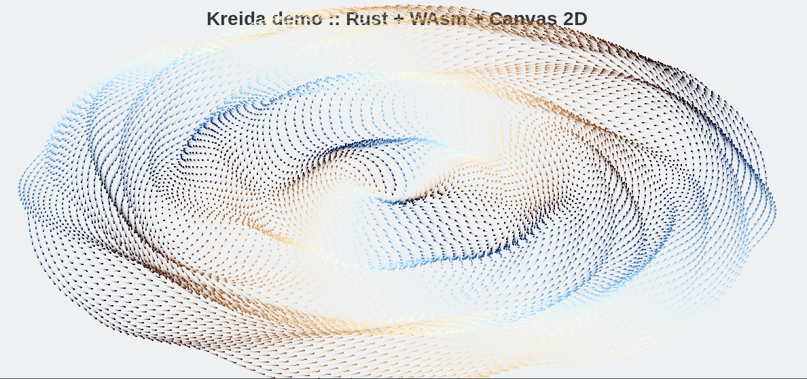

# kreida-rs WAsm Demo

## Build

### Requirements

To build the project you need [trunk](https://crates.io/crates/trunk).

``` sh
cargo install trunk
```

Build: 

``` sh
trunk build --release
```

Build and run on localhost

``` sh
trunk serve --release
```

and then open `http://127.0.0.1:5000/static/` in your browser.

## Prepared demo

You can also look at this at [demo.irbis-labs.com/kreida](http://demo.irbis-labs.com/kreida/).


## Screenshots





## License

Licensed under either of
 * Apache License, Version 2.0 ([LICENSE-APACHE](LICENSE-APACHE) or http://www.apache.org/licenses/LICENSE-2.0)
 * MIT license ([LICENSE-MIT](LICENSE-MIT) or http://opensource.org/licenses/MIT)
at your option.


### Contribution

Unless you explicitly state otherwise, any contribution intentionally submitted
for inclusion in the work by you, as defined in the Apache-2.0 license,
shall be dual licensed as above, without any additional terms or conditions.
