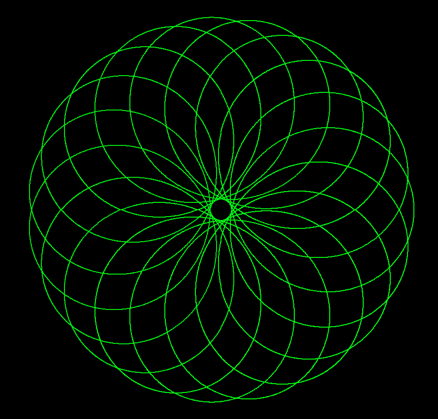
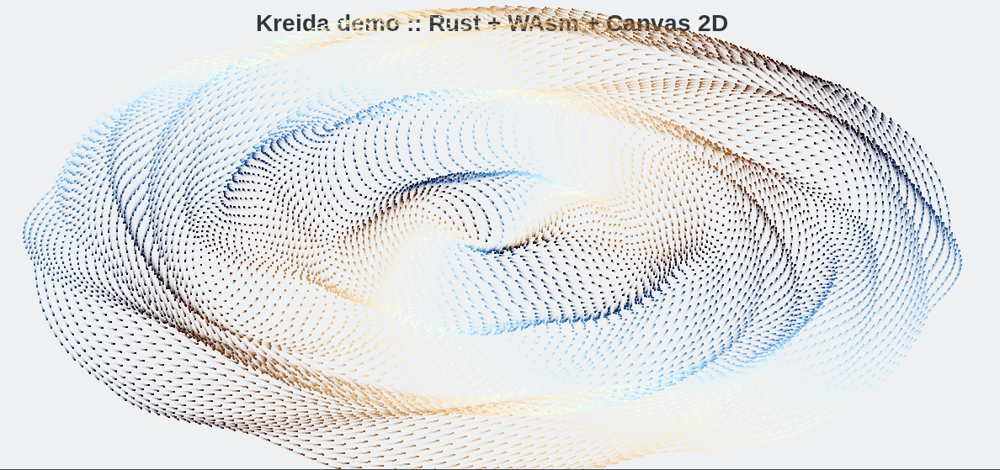

# kreida-rs WAsm Demo

## Build

### Requirements

#### [Emscripten](https://kripken.github.io/emscripten-site/docs/index.html)

* [Building graphical applications to JS in stable Rust](https://gregkatz.github.io/2017-05-20-rust-emscripten.html)
* [The Path to Rust on the Web](http://asquera.de/blog/2017-04-10/the-path-to-rust-on-the-web/)

> First, add the wasm32 target via rustup:

```sh
rustup target add wasm32-unknown-emscripten
```

> Now, install the emscripten SDK.

This will take nearly an hour, a lot of RAM, and about 20 Gb of HDD. 

```sh
curl -O https://s3.amazonaws.com/mozilla-games/emscripten/releases/emsdk-portable.tar.gz
tar -xzf emsdk-portable.tar.gz
source emsdk-portable/emsdk_env.sh
emsdk update
emsdk install sdk-incoming-64bit
emsdk activate sdk-incoming-64bit
```

> You may need to run `source emsdk-portable/emsdk_env.sh` one extra time

#### [Just](https://crates.io/crates/just)

``` sh
cargo install just
```

## Build and Run

``` sh
just
```

or

``` sh
just debug
```


## Screenshots





## License

Licensed under either of
 * Apache License, Version 2.0 ([LICENSE-APACHE](LICENSE-APACHE) or http://www.apache.org/licenses/LICENSE-2.0)
 * MIT license ([LICENSE-MIT](LICENSE-MIT) or http://opensource.org/licenses/MIT)
at your option.


### Contribution

Unless you explicitly state otherwise, any contribution intentionally submitted
for inclusion in the work by you, as defined in the Apache-2.0 license,
shall be dual licensed as above, without any additional terms or conditions.
